# 042 基于 Spark 的小说推荐系统-设计展示

> **代码有偿获取 可接受定制 微信联系方式: csbysj2020 或 ACE2487，备注(BS)**

> 

> 

## 介绍

该小说推荐系统综合运用了多种技术，以提供全面的小说推荐和管理功能。系统的核心技术包括：

1. **Python**：用于编写系统的各个部分，包括数据抓取、推荐算法和 Web 应用程序。
2. **PySpark**：利用 Spark 的强大数据处理能力进行大规模数据分析和处理，提高系统的效率和性能。

3. **Hadoop**：负责数据存储和处理，保证系统能够处理海量数据并具备高可靠性。

4. **Django**：用作 Web 框架，负责实现用户管理、小说分类、查询及后台管理等功能。Django 的 ORM 功能使得数据模型的管理更加高效。

5. **Scrapy**：实现数据抓取模块，从“纵横小说”网站上抓取小说数据。通过定义爬虫、解析网页和存储数据，该框架确保了数据的完整性和准确性。

6. **Vue.js**：用于构建前端用户界面，提供直观和响应式的用户体验。

7. **Element Plus**：作为 Vue.js 的 UI 框架，提供丰富的组件和交互，增强了前端的可用性和美观度。

8. **协同过滤算法**：实现了基于用户和物品的推荐算法，通过分析用户行为和物品相似度，向用户推荐相关的小说，提高推荐的准确性和个性化。

系统功能模块具体包括：

- **数据抓取模块**：使用 Scrapy 框架抓取“纵横小说”网站的小说数据，包括书名、作者、评分等，并存储到数据库中。
- **用户模块**：实现用户注册和登录功能，允许用户管理个人信息和访问系统的个性化功能。

- **小说分类模块**：展示小说的分类信息，并允许用户按分类快速查找小说。

- **小说查询模块**：支持根据书名、分类、作者等条件进行小说查询，并通过分页展示结果，减少数据库负担。

- **协同过滤推荐模块**：基于用户和物品的协同过滤算法，为用户推荐个性化的小说，提升推荐效果。

- **后台管理模块**：允许管理员登录系统，管理抓取到的小说数据，包括查看和修改小说信息。

整个系统通过整合这些技术和模块，为用户提供了高效、智能的小说推荐体验，同时保证了数据的管理和系统的扩展性。

## 视频

> **点击查看 \>\>\> [https://www.bilibili.com/video/BV1QvHaeREkx/](https://www.bilibili.com/video/BV1QvHaeREkx/)**

## 截图

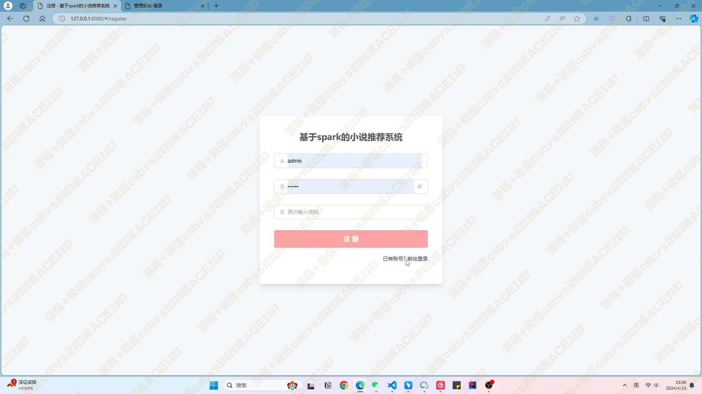
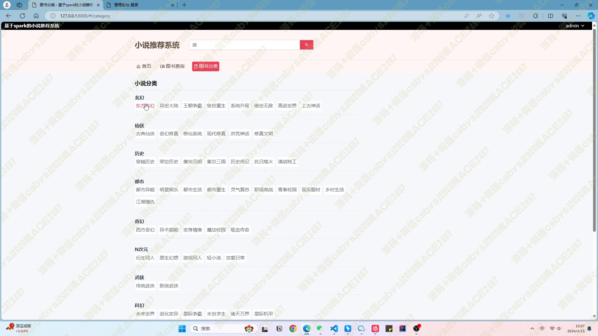
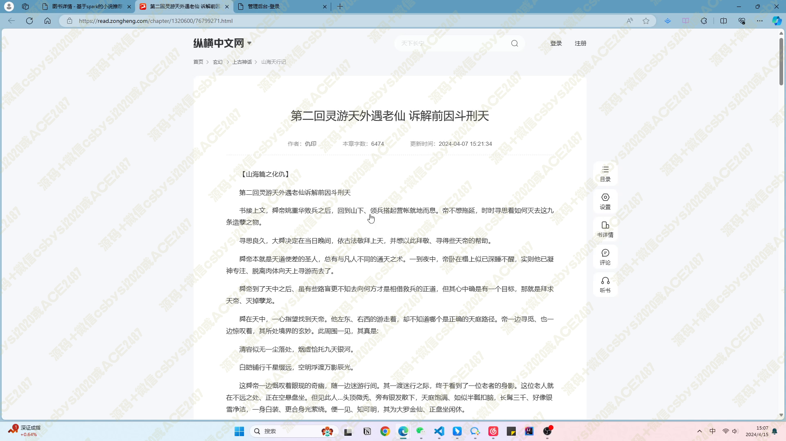
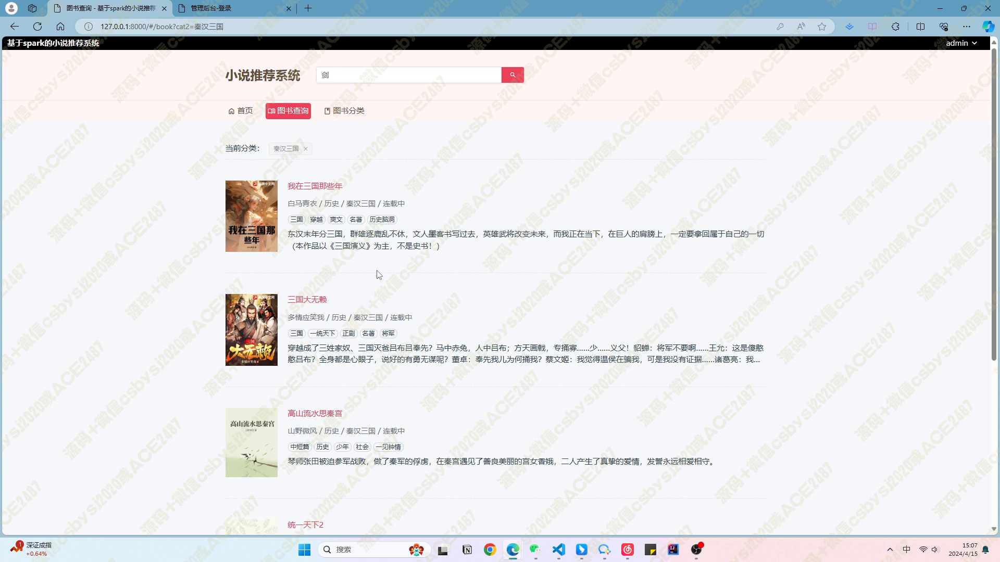
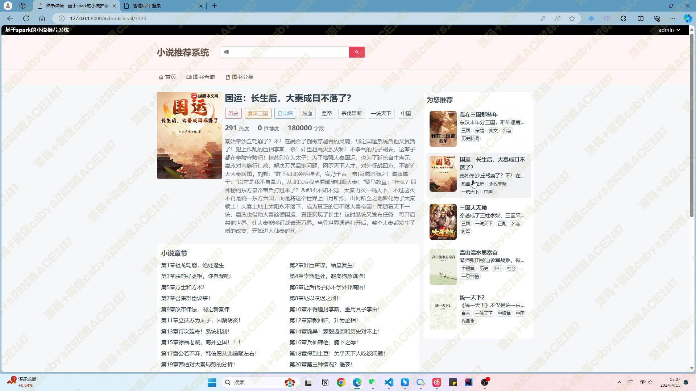
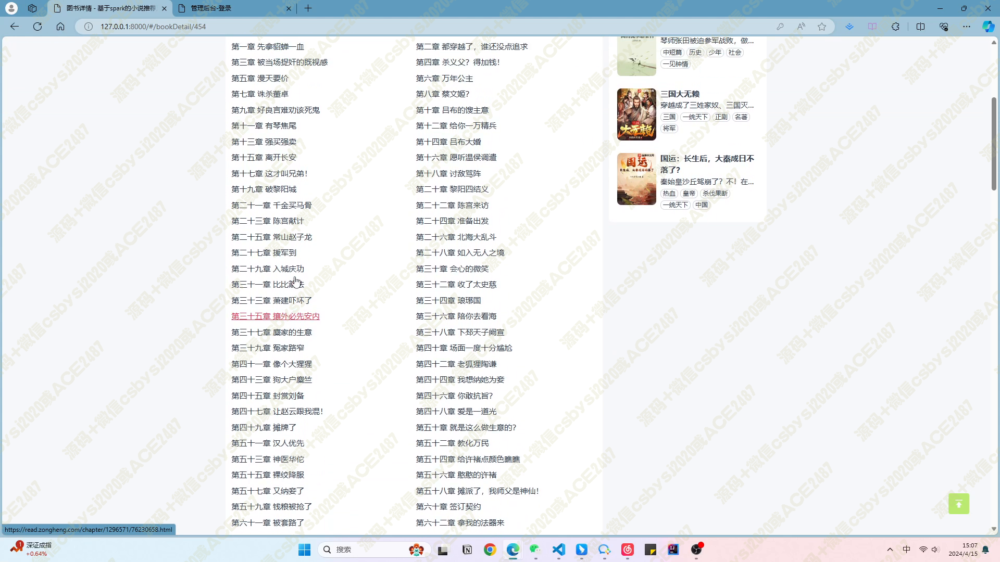
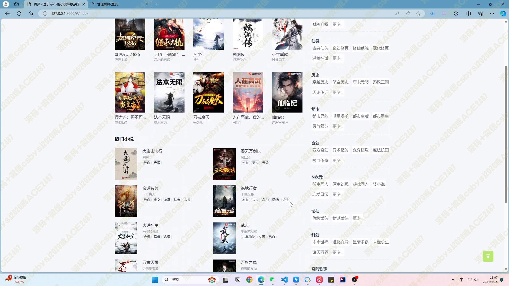
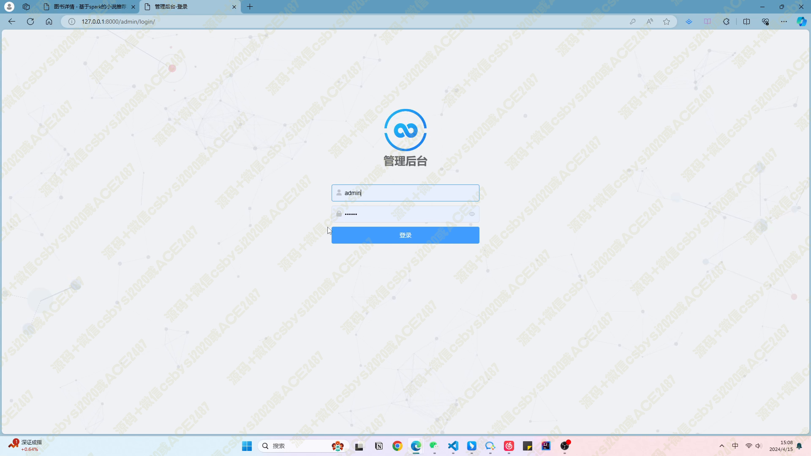
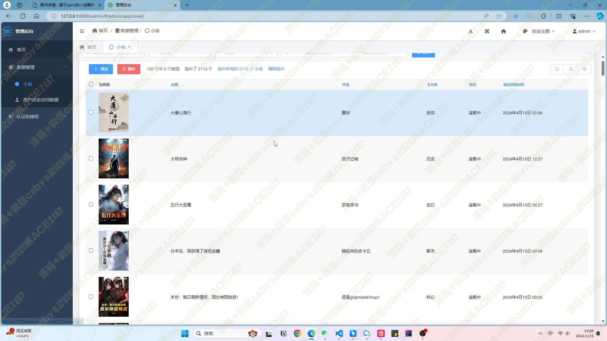
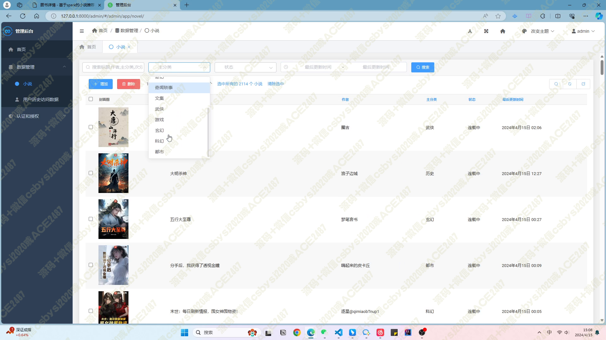
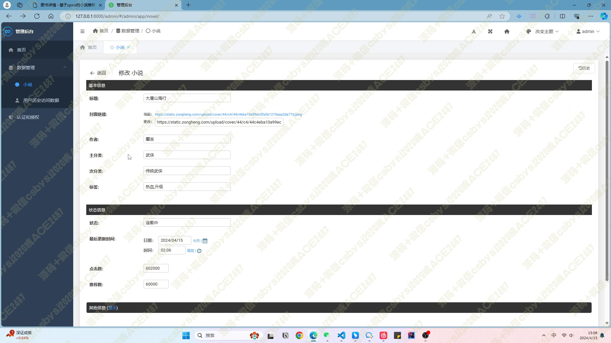
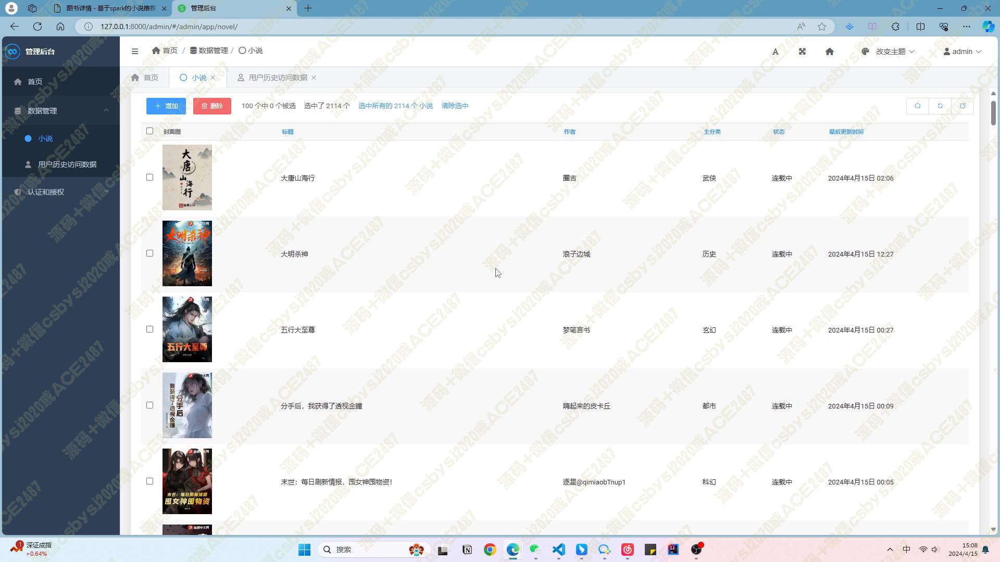
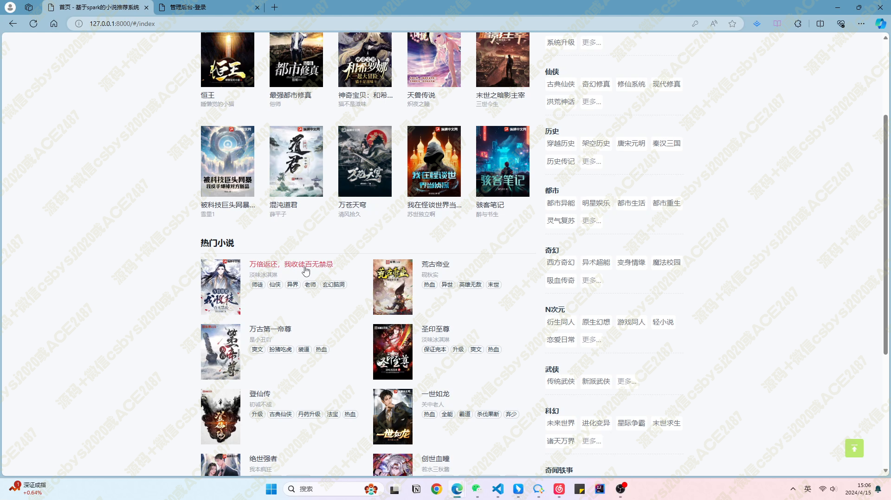
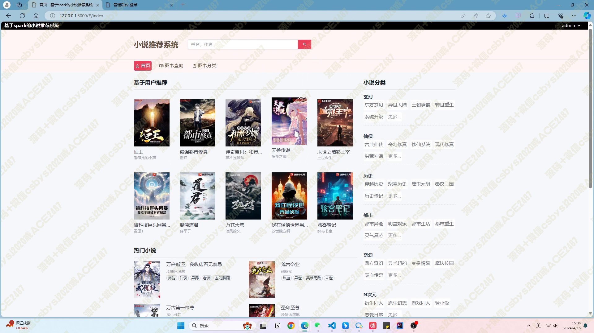
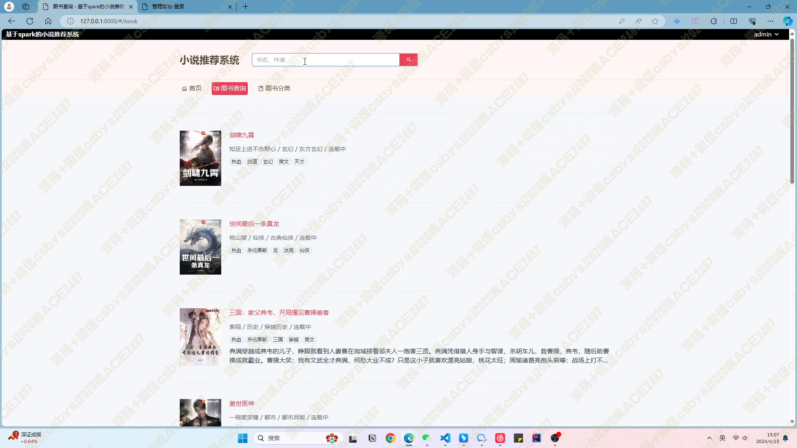
